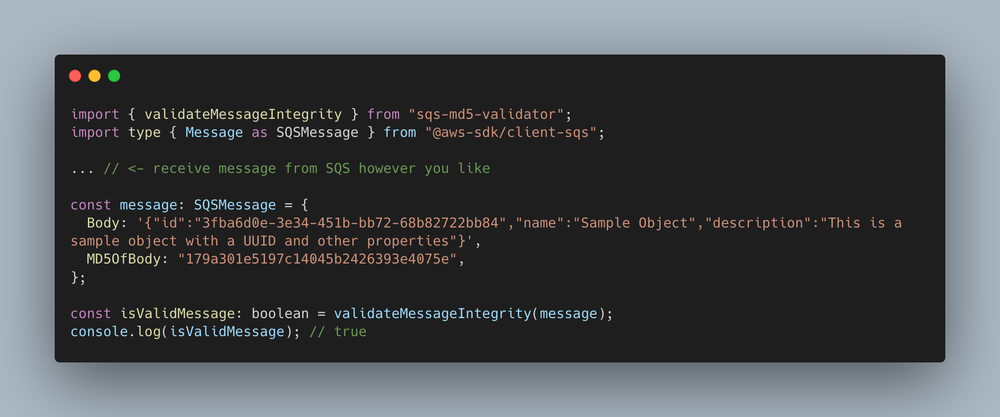
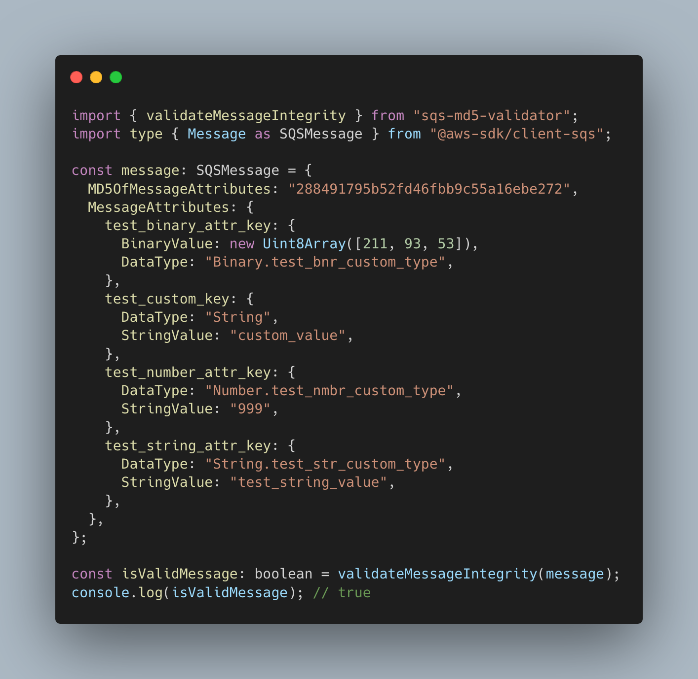

# SQS MD5 Validator


## Overview

The SQS MD5 Validator is a tool designed to ensure the integrity of messages sent and received through Amazon Simple Queue Service (SQS). It calculates and verifies the MD5 hash of message bodies to confirm that the content has not been altered during transmission.

## Features

- Validate SQS Messages integrity
- Verify MD5 hashes for SQS messages (Body & Message Attributes)

## Installation

To install the SQS MD5 Validator via npm, run the following command:

```sh
npm install sqs-md5-validator
```

Make sure you have Node.js and npm installed on your machine. You can verify the installation by running:

```sh
node -v
npm -v
```

## Usage

To validate the integrity of an SQS message:

<p align="center">
  
</p>

Also works with SQS message attributes (MessageAttributes property):

<p align="center">
  
</p>

## Contributing

Contributions are welcome! Please submit a pull request with your changes.

## License

This project is licensed under the MIT License.

## Contact

For questions or support, please open an issue on the GitHub repository.
